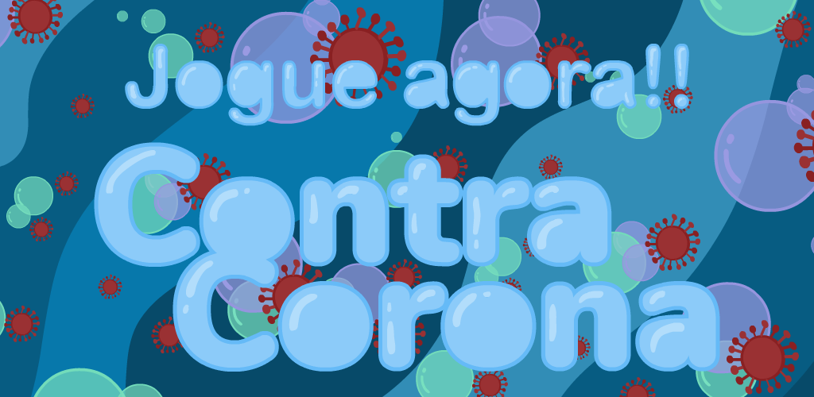

# Contra Corona

OVERVIEW
--------------------------------------------------
Contra Corona is an educational game that teaches you how to prevent yourself against COVID-19 virus, there's no code in this repository, this is just to show the project.
I've worked on it in the beginning of 2020 at Ludo Educativo with a team of 5 people. 
- Otávio Sumi:    Programmer
- Luna Gallo:     Programmer
- Renata Vinhaga: Programmer
- Anayã Ferreira:  Artist and Designer
- Wesley Tiozzo:  Music and Sound Effects

This project consists of 3 mini-games that aim to raise awareness about the corona virus, in the first game you learn how to wash your hands, the second is to show the importance of wearing masks and the third is about social distancing.

Contra Corona was made by a partnership between Aptor Software, Batatando Games, University of São Carlos and FAPESP (Research Support Foundation of the State of S. Paulo).
What I've tried to do was to make 4 different tracks, each one having its own style: electronic, ambient, saloon music and swing jazz.

THE GAME
--------------------------------------------------
You can play the game for free at: www.ludoeducativo.com.br/pt/play/contra-corona

